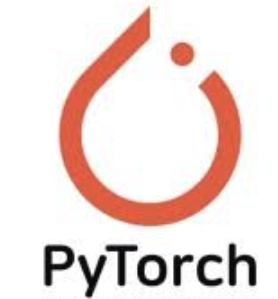
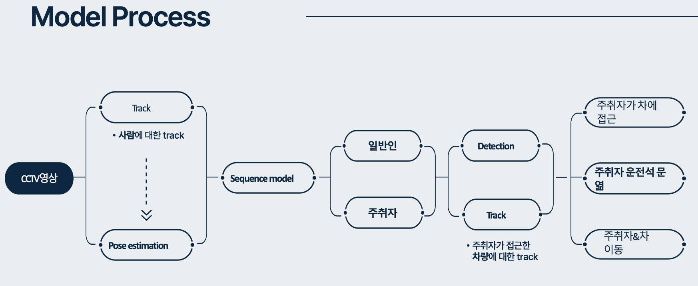
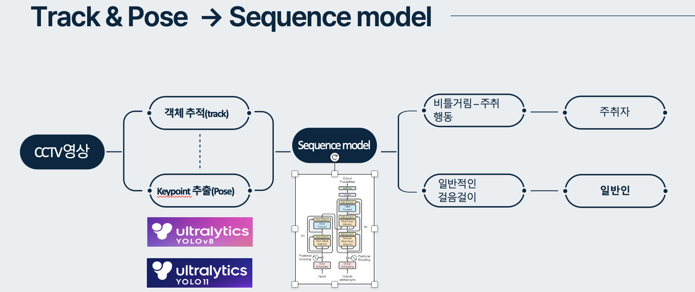
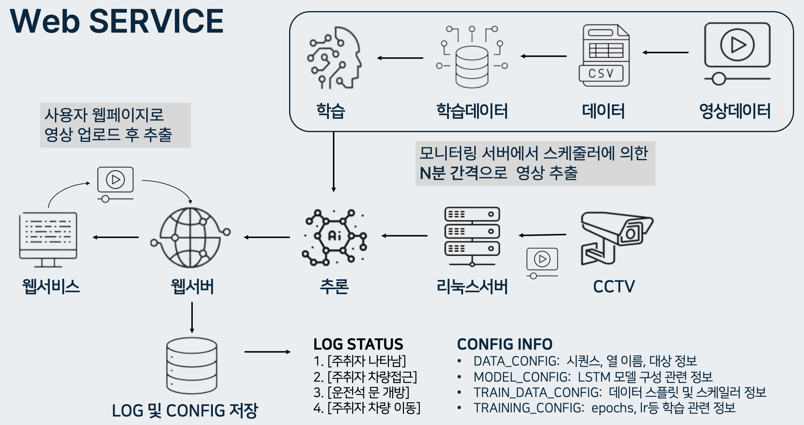

<h1 align="center"> 
영상기반 주취행동분석 및 주취운전 감지 
  

### 컴퓨터 비전과 딥러닝 기술을 활용하여 영상(CCTV)에서 주취행동(술에 취한 행동)과 차량을 탐지하여 주취자가 차량을 탑승하는 행위를  감지하는 모델을 개발 
  
# 사용 기술

# **주취자 차량 탑승 감지 모델**

## **프로젝트 개요**  
컴퓨터 비전과 딥러닝 기술을 활용하여 영상(CCTV)에서 주취행동(술에 취한 행동)과 차량을 탐지하고,  
**주취자가 차량을 탑승하는 행위를 감지**하는 모델을 개발하였습니다.  

---

## **주취자 행동 인식 파트**

### **데이터**  
주취행동(비틀거림)이 있는 사람들과 일반인의 보행행동이 포함된 동영상을 AIHUB에서 확보하였습니다.  
수집한 영상 데이터의 최소 프레임 속도가 3fps였기 때문에 이를 기준으로 다운샘플링 후에 YOLO Tracking 모델을 활용하여 객체를 지속적으로 식별하였습니다. 이를 YOLO Pose Estimation을 사용하여 사람의 관절과 같은 특징 34개의 Keypoint를 추출하였습니다.  
이 데이터를 시계열 데이터로 활용하기 위해 90프레임으로 분리 후 `'주취행동'`과 `'정상행동'`으로 분류하여 라벨링을 수행하였습니다.

### **전처리**
주취자의 행동 패턴 분석 방법으로 3가지 방식을 제안하였습니다:  
1. **Keypoint Align 방식**  
   - 34개의 Keypoint를 정렬하여 학습.  
2. **기울기 및 거리 계산 방식**  
   - 양 골반의 중심점을 기준으로 기울기와 거리를 계산하여 학습.  
3. **관절 각도 계산 방식**  
   - 팔과 다리의 각도를 계산하여 학습.  

각각의 학습 모델에 다양한 파라미터를 조정하며 최적의 모델 성능을 도출하였습니다.

### **모델**
주취자 탐지의 초기 단계에서는 **LSTM(Long Short-Term Memory)** 모델을 사용하여 주취자를 감지하였으나,  
더 나은 성능을 확보하기 위해 **BERT와 Transformer** 모델로 변경하여 학습을 진행하였습니다.

### **결과**  
LSTM, BERT, Transformer 모델에 같은 데이터셋을 사용하여 결과를 비교한 결과,  
Transformer의 F1 Score가 0.72로 다른 모델의 성능보다 높음을 확인하였습니다.

---

## **차량 인식 파트**

### **데이터**
다양한 각도의 차량과 운전석 문 열림 이미지를 AIHUB, YouTube, Roboflow, Bird's Eye View, Google 웹 크롤링을 통해 확보하였습니다.

### **전처리**
- 이미지 데이터에서 다양한 각도 환경에서의 **‘사람’, ’차량’, ’운전석 문열림’, ’다른 좌석 문열림’**으로 딕텍션을 수행하였습니다.  
- OpenCV를 활용하여 **밝기 변경 (Brightness Adjustment)**과 **대비 변경 (Contrast Adjustment)** 어그멘테이션을 진행하였습니다.

### **모델**
- **YOLOv8-n, YOLOv8-L, YOLOv11-n, YOLOv11-L** 모델을 사용하여 다양한 이미지 크기(640, 800, 1024)에서 학습.  
- 총 2,920장의 이미지와 16,100개의 바운딩 박스(Annotation)를 학습 데이터로 사용하였습니다.  

### **결과**
여러 모델을 테스트한 결과, **YOLOv8-L** 모델이 mAP50에서 가장 좋은 성능 지표를 나타내어 확정 모델로 사용하였습니다.

---

## **모델 통합 및 로직 구현**

- **주취자 행동 감지**:  
  Transformer 모델을 사용하여 시계열 데이터를 학습하고 주취 행동을 효과적으로 감지.  

- **차량 및 행동 상호작용 분석**:  
  YOLOv8-L 모델을 활용하여 차량 및 운전석 문 열림 상태를 정확히 탐지.  
  - **IOU(Intersection Over Union)** 값을 계산하여 주취자와 차량 간 상호작용을 추적.  
  - 차량의 이동 경로를 분석하여 주취자가 차량에 탑승하는 상황을 인지할 수 있는 시스템을 구현.

---

## **Service: 웹 서비스 및 스케줄러**

### **웹 서비스**  
- 영상 데이터를 업로드하면 인퍼런스한 결과를 실시간으로 스트리밍하여 확인할 수 있는 기능을 구현.  
- **FASTAPI**를 사용해 웹 서버를 구축하고, **MySQL** 데이터베이스에 인퍼런스 로그를 저장하여 웹에서 조회할 수 있도록 설계.

### **스케줄러 기능**  
- 서버에 축적된 영상 데이터를 사용자 설정 시간마다 자동으로 인퍼런스할 수 있도록 스케줄러를 구현.  

---

## **성과 및 경험**  
이 프로젝트를 통해 데이터를 기반으로 문제를 정의하고, 기술적인 해결책을 제시하며, 이를 서비스로 구현하는 전 과정을 수행할 수 있었습니다.  
앞으로도 이러한 기술적 경험을 바탕으로 실질적인 가치를 창출하는 AI 솔루션을 개발하며 성장하고자 합니다.
